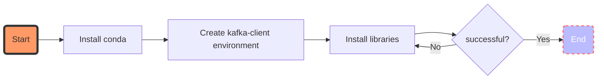
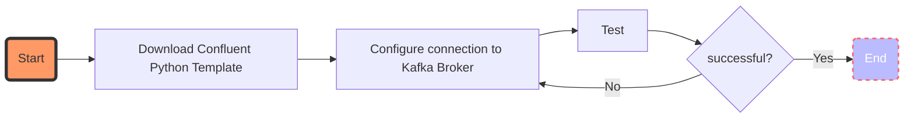
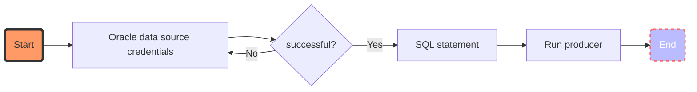
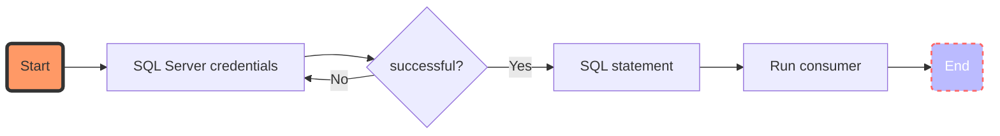

# Instructive

![alt text][architecture]

## Create Python environment



1. Install conda

```shell
#!/bin/bash
wget https://repo.anaconda.com/miniconda/Miniconda3-latest-Linux-x86_64.sh
bash Miniconda3-latest-Linux-x86_64.sh
```

2. Create kafka-client environment

```shell
#!/bin/bash
conda create --name kafka-client python=3.9
conda activate kafka-client
```

3. Install libraries

Install the required libraries for the development of producers and consumers.
```shell
#!/bin/bash
pip3 install -r requirements.txt
wget https://files.pythonhosted.org/packages/24/f9/bfed0e66f354e710399009109f89b3046a7a96373e036772b4cc32491189/pymssql-2.2.1-cp39-cp39-manylinux1_x86_64.whl#sha256=a67b45a91203a35251d427cd35a316e878a27d275f20a6ae815a0db6bb0769de
pip3 install pymssql-2.2.1-cp39-cp39-manylinux1_x86_64.whl
```

requeriments.txt
```text
requests
certifi
confluent-kafka[avro,json,protobuf]>=1.7.0
cx_Oracle==8.2.1
```

## Previous configuration



1. Download Confluent Python Template
```shell
#!/bin/bash
cd /tmp/kafka-client/dev
git clone https://github.com/confluentinc/examples
git checkout 6.2.0-post
cd /tmp/kafka-client/dev/examples/clients/cloud/python/
```

2. Configure connection to Kafka Broker
```shell
#!/bin/bash
cd /tmp/kafka-client/dev/examples/clients/cloud/python/
vi librdkafka.config
```
librdkafka.config
```text
bootstrap.servers=localhost:9092
```


## Producer



Filename producer-test.py


1. Oracle data source credentials

```python
    connection = cx_Oracle.connect(user="USER", password="PASS",
                                   dsn="HOSTNAME/SERVICE")
```
2. SQL statement
```python
    # Get 10 rows
    cursor.execute("""
            SELECT col1, col2, col3
            FROM table
            WHERE rownum <= :did""",
                   did=10)
```

3. Run producer
```shell
#!/bin/bash
cd /tmp/kafka-client/dev/examples/clients/cloud/python/
./producer-test.py -f librdkafka.config -t {name-topic}
```


## Consumer



Filename consumer-test.py

1. SQL Server credentials

```python
    conn = pymssql.connect(
        host=r'HOSTNAME',
        user=r'NAMEDOMAIN\USER',
        password='PASS',
        database='NAMEDATABASE'
    )

    cursor = conn.cursor()
```
2. SQL statement
```python
    cursor.execute('INSERT INTO table VALUES (%s, %s, %s)', (col1, col2, col3))
```

3. Run consumer
```shell
#!/bin/bash
cd /tmp/kafka-client/dev/examples/clients/cloud/python/
./consumer-test.py -f librdkafka.config -t {name-topic}
```


#References


[Librerias Python Oracle][1]

[Librerias Python SQL Server][2]

[Python: Code Example for Apache Kafka - Confluent][3]

[Python SQL Driver - pymssql][4]


[1]: https://cx-oracle.readthedocs.io/en/latest/user_guide/installation.html#oracle-instant-client-zip-files
[2]: https://pymssql.readthedocs.io/en/latest/intro.html
[3]: https://docs.confluent.io/platform/current/tutorials/examples/clients/docs/python.html
[4]: https://docs.microsoft.com/en-us/sql/connect/python/pymssql/step-3-proof-of-concept-connecting-to-sql-using-pymssql?view=sql-server-ver15

[architecture]: hhttps://github.com/imendozah/kafka-cli-py/raw/master/images/architecture.png "Logo Title Text 2"
